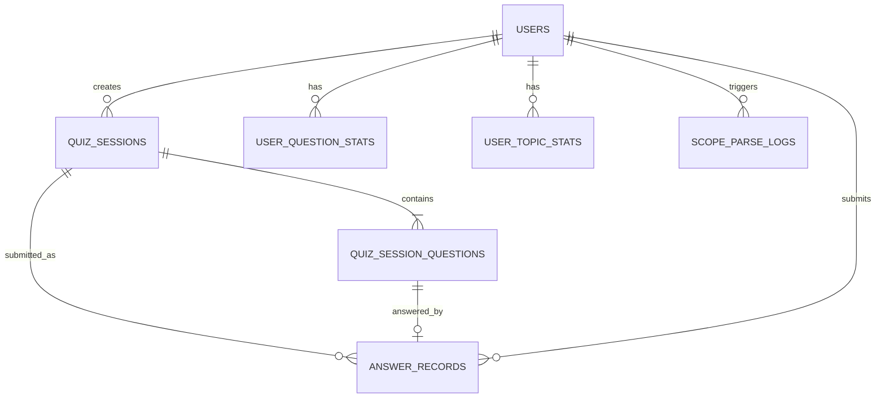

# DATA_MODEL: 数据模型

## 1. 数据库划分

项目使用两个 SQLite 文件。

| 数据库 | 用途 | 写入方 |
|---|---|---|
| `fe_siken_questions.sqlite` | 题库、题目详情、图片资产 | 题库构建流程，MVP 运行时只读 |
| `app.sqlite` | 用户、测试、答案、统计 | bot / web |

## 2. 题库数据库

### `questions`

| 字段 | 类型 | 说明 |
|---|---|---|
| `id` | INTEGER PRIMARY KEY | 题目索引 ID |
| `source_page_label` | TEXT | 来源页标签 |
| `source_page_url` | TEXT | 来源页 URL |
| `exam_part` | TEXT | `科目A` 或 `科目B` |
| `question_no` | TEXT | 题号 |
| `topic` | TEXT | 题目主题 |
| `category` | TEXT | 分类 |
| `url` | TEXT UNIQUE | 原题 URL |
| `scraped_at` | TEXT | 抓取时间 |

MVP 只使用 `exam_part = '科目A'`。

### `question_details`

| 字段 | 类型 | 说明 |
|---|---|---|
| `question_url` | TEXT PRIMARY KEY | 对应 `questions.url` |
| `question_text` | TEXT | Markdown/纯文本题干，图片使用 `/assets/...` |
| `question_html` | TEXT | 原始题干 HTML 片段 |
| `choices_json` | TEXT | 选项 JSON，值可包含 Markdown 图片 |
| `choices_html_json` | TEXT | 选项原始 HTML JSON |
| `answer` | TEXT | 正确答案标签 |
| `explanation` | TEXT | Markdown/纯文本解析，图片使用 `/assets/...` |
| `explanation_html` | TEXT | 原始解析 HTML |
| `images_json` | TEXT | 图片资产元数据数组 |
| `has_images` | INTEGER | 是否含图片 |
| `fetched_at` | TEXT | 详情抓取时间 |

### `question_assets`

| 字段 | 类型 | 说明 |
|---|---|---|
| `id` | INTEGER PRIMARY KEY | 资产 ID |
| `question_url` | TEXT | 对应题目 URL |
| `section` | TEXT | `question` / `choice` / `explanation` |
| `choice_label` | TEXT | 选项标签，可为空 |
| `asset_type` | TEXT | 当前为 `image` |
| `url` | TEXT | 原远程图片 URL |
| `local_path` | TEXT | 本地文件路径 |
| `public_path` | TEXT | Web public path |
| `alt` | TEXT | 图片 alt |
| `width` | TEXT | 原始宽度 |
| `height` | TEXT | 原始高度 |
| `order_index` | INTEGER | 片段内顺序 |
| `fetched_at` | TEXT | 记录时间 |

## 3. app.sqlite 建议实体

### `users`

| 字段 | 类型 | 说明 |
|---|---|---|
| `id` | TEXT PRIMARY KEY | 本地用户 ID |
| `telegram_user_id` | TEXT UNIQUE NOT NULL | Telegram 用户 ID |
| `telegram_username` | TEXT | Telegram username，可为空 |
| `telegram_first_name` | TEXT | Telegram first name，可为空 |
| `telegram_last_name` | TEXT | Telegram last name，可为空 |
| `created_at` | TEXT | 创建时间 |
| `last_seen_at` | TEXT | 最近互动时间 |

### `quiz_sessions`

| 字段 | 类型 | 说明 |
|---|---|---|
| `id` | TEXT PRIMARY KEY | session ID |
| `token` | TEXT UNIQUE NOT NULL | 随机访问 token |
| `user_id` | TEXT NOT NULL | 创建 token 的用户 |
| `raw_scope_input` | TEXT NOT NULL | 用户原始输入 |
| `matched_scope_json` | TEXT | 关键词/AI 匹配结果 |
| `selection_summary_json` | TEXT | 选题构成摘要 |
| `status` | TEXT NOT NULL | `created` / `submitted` / `error` |
| `total_questions` | INTEGER NOT NULL | 固定 20 |
| `correct_count` | INTEGER | 首次提交正确数 |
| `incorrect_count` | INTEGER | 首次提交错误数 |
| `created_at` | TEXT | 创建时间 |
| `submitted_at` | TEXT | 首次提交时间 |
| `expires_at` | TEXT | 未提交 token 过期时间，默认创建后 7 天 |
| `purge_after_at` | TEXT | 过期未提交 session 清理时间，默认创建后 30 天 |

约束：

- `total_questions = 20`。
- `token` 必须足够随机。
- 首次提交后 `status = submitted`。
- 未提交且超过 `expires_at` 后不可提交。
- 已提交 session 不受 `expires_at` 限制，结果永久可看。

### `quiz_session_questions`

| 字段 | 类型 | 说明 |
|---|---|---|
| `id` | TEXT PRIMARY KEY | session question ID |
| `quiz_session_id` | TEXT NOT NULL | session ID |
| `question_url` | TEXT NOT NULL | 题库题目 URL |
| `question_index` | INTEGER NOT NULL | 1-20 |
| `source_type` | TEXT NOT NULL | `requested_scope` / `wrong_question` / `weak_topic` / `high_weight_topic` |
| `source_topic` | TEXT | 题目主题快照 |
| `source_category` | TEXT | 分类快照 |
| `selection_reason` | TEXT | 选中原因 |

约束：

- 同一 session 内 `question_index` 唯一。
- 同一 session 内 `question_url` 唯一。

### `answer_records`

| 字段 | 类型 | 说明 |
|---|---|---|
| `id` | TEXT PRIMARY KEY | 答案记录 ID |
| `quiz_session_id` | TEXT NOT NULL | session ID |
| `quiz_session_question_id` | TEXT NOT NULL | session 中的题 |
| `user_id` | TEXT NOT NULL | 用户 ID |
| `question_url` | TEXT NOT NULL | 题目 URL |
| `selected_answer` | TEXT NOT NULL | 用户首次选择 |
| `correct_answer` | TEXT NOT NULL | 正确答案快照 |
| `is_correct` | INTEGER NOT NULL | 0 / 1 |
| `answered_at` | TEXT | 首次提交时间 |

约束：

- 同一 `quiz_session_question_id` 只能有一条答案记录。
- 重复提交不新增记录。

### `user_question_stats`

按用户和题目维护历史表现。

| 字段 | 类型 | 说明 |
|---|---|---|
| `user_id` | TEXT | 用户 ID |
| `question_url` | TEXT | 题目 URL |
| `attempt_count` | INTEGER | 作答次数 |
| `correct_count` | INTEGER | 答对次数 |
| `incorrect_count` | INTEGER | 答错次数 |
| `last_answered_at` | TEXT | 最近作答时间 |
| `last_is_correct` | INTEGER | 最近一次是否正确 |
| `active_wrong` | INTEGER | 是否在活跃错题池 |
| `consecutive_correct_after_wrong` | INTEGER | 错题后连续答对次数 |

主键：

- `(user_id, question_url)`

错题规则：

- 答错：`active_wrong = 1`，`consecutive_correct_after_wrong = 0`。
- 活跃错题答对：连续答对 +1。
- 连续答对达到 2：`active_wrong = 0`。

### `user_topic_stats`

按用户和主题/分类维护正确率。

| 字段 | 类型 | 说明 |
|---|---|---|
| `user_id` | TEXT | 用户 ID |
| `topic_key` | TEXT | 主题或分类 key |
| `topic_type` | TEXT | `topic` / `category` / `configured_topic` |
| `attempt_count` | INTEGER | 累计答题数 |
| `correct_count` | INTEGER | 答对数 |
| `incorrect_count` | INTEGER | 答错数 |
| `accuracy` | REAL | 正确率 |
| `last_answered_at` | TEXT | 最近作答时间 |

### `scope_parse_logs`

| 字段 | 类型 | 说明 |
|---|---|---|
| `id` | TEXT PRIMARY KEY | 日志 ID |
| `user_id` | TEXT | 用户 ID |
| `raw_input` | TEXT | 原始输入 |
| `method` | TEXT | `alias` / `keyword` / `ai` |
| `matched_scope_json` | TEXT | 匹配结果 |
| `suggestions_json` | TEXT | 相近主题建议 |
| `status` | TEXT | `matched` / `no_match` / `error` |
| `error_message` | TEXT | 错误信息 |
| `created_at` | TEXT | 创建时间 |

统计粒度：

- 底层同时记录题库原始 `category` 与 `topic`。
- 如果题目的 `category` 能通过 `topics.category_tree` 反推出大分类，同时更新 `configured_topic` 统计。
- 选题和弱项判断优先使用 `configured_topic`。
- 无法映射到大分类时，保留原始 `category` / `topic` 统计。
- `questions.topic` 表示题目级要点，不作为用户练习范围匹配主入口。

## 4. 实体关系

## 5. 事务要求

首次提交必须在同一事务内完成：

1. 校验 session/token 未提交。
2. 校验 20 题全部作答。
3. 写入 `answer_records`。
4. 更新 `quiz_sessions` 为 `submitted`。
5. 更新 `user_question_stats`。
6. 更新 `user_topic_stats`。
7. 提交事务。

如果任一步失败，事务回滚。

## 6. migration

`app.sqlite` schema 使用 Drizzle Kit / drizzle-orm migrations 管理，不使用手动 SQL 作为长期维护方式。
