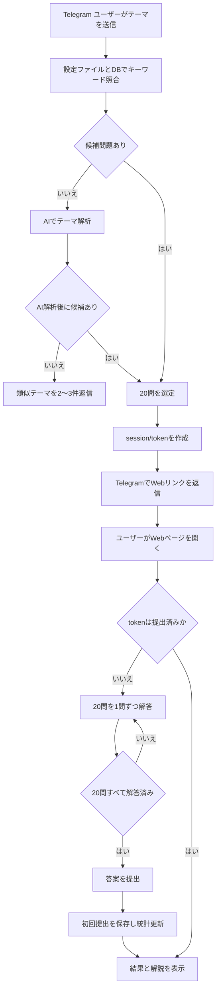

# USER_FLOW: Telegram 入口与 Web 演習流程

## 1. 主流程

### 流程 A: Telegram 创建测试

1. 用户打开 Telegram Bot。
2. 用户发送 `/start`、`/help` 或直接输入练习范围。
3. Bot 使用日文返回简短说明。
4. 用户输入中文或日文主题，例如 `数据库`、`データベース`、`情報セキュリティ`。
5. 系统先执行确定性匹配：
   - `topics.category_tree` 顶层大分类
   - `topics.category_tree` 下的小分类
   - YAML 主题别名表
6. 若匹配到大分类，从该大分类下所有小分类对应的 `questions.category` 抽题。
7. 若匹配到小分类，优先从该小分类抽题；题量不足时从同一大分类的兄弟小分类补足。
8. 若未匹配，调用 AI 从现有大分类 / 小分类中推荐。
9. 若仍无题目匹配，Bot 用日文返回 2-3 个相近主题建议，不创建测试。
10. 若匹配成功，系统创建 20 题 session 和随机 token。
11. Bot 直接返回 Web 测试链接。

### 流程 B: Web 页面作答

1. 用户打开 `/quiz/{token}`。
2. Web API 校验 token 是否存在。
3. 若 token 未提交但已过期，页面显示日文过期提示。
4. 若 token 未提交且未过期，页面加载 20 道题。
5. 页面一题一屏展示题目。
6. 顶部显示回答进度。
7. 用户通过上一题 / 下一题切换。
8. 用户可打开题号导航跳转任意题；小屏为底部 Sheet，大屏为右侧抽屉。
9. 用户选择答案后，前端将未提交进度保存到 `localStorage`。
10. 用户答完 20 题后提交。
11. 后端保存首次提交结果并锁定 token。
12. 页面显示成绩、错题解析和展开全部解析入口。

### 流程 C: 重复打开已提交 token

1. 用户再次打开同一个 token 链接。
2. Web API 发现 session 已提交。
3. 页面展示已提交结果。
4. 页面显示首次答案、正确答案、解析和来源 URL。
5. 不显示提交按钮。
6. 不允许更新历史记录。

## 2. Mermaid 主流程

## 3. 边缘用例

| 场景 | 处理 |
|---|---|
| 用户输入空消息 | Bot 用日文提示输入练习主题 |
| 用户输入范围完全无匹配 | 不生成测试，返回相近主题建议 |
| 指定范围不足 15 题 | 范围内有多少出多少，其余由补强题补足 |
| 补强池也不足 | 从高权重主题继续补足，仍保证总数 20；若理论上仍不足，返回系统错误 |
| token 不存在 | Web 页面显示日文错误信息 |
| token 已过期且未提交 | Web 页面显示日文过期提示，不允许提交 |
| token 已提交 | 显示锁定后的结果页 |
| 用户未答完就提交 | 前端阻止提交；后端也校验 20 题完整性 |
| 用户刷新页面 | 未提交选择从 `localStorage` 恢复 |
| 用户换设备打开 | 未提交选择无法恢复 |
| 重复提交 | 返回已提交结果，不写历史 |
| 图片加载失败 | Web 页面显示 alt，并可利用 `question_assets` 做兜底检查 |
| AI 服务不可用 | 若关键词匹配失败，则 Bot 返回无法解析和建议稍后重试 |

## 4. Web 页面状态

| 状态 | 描述 |
|---|---|
| `loading` | 正在加载 token、题目或结果 |
| `active` | token 未提交，用户正在作答 |
| `incomplete` | 仍有题目未答完 |
| `ready_to_submit` | 20 题全部已答 |
| `submitting` | 正在提交首次答案 |
| `submitted` | 已提交并显示结果 |
| `locked` | token 已提交，只能查看结果 |
| `not_found` | token 无效或不存在 |
| `error` | 系统异常 |

## 5. 错误处理流程

### 主题无法匹配

1. 保存原始输入和解析失败原因。
2. 不创建 session。
3. Bot 返回日文提示。
4. Bot 给出 2-3 个相近主题建议。

### 提交失败

1. 后端在事务中校验 token、题目数量、答案合法性和提交状态。
2. 如果已提交，返回已提交结果。
3. 如果数据不完整，返回校验错误。
4. 如果写入失败，事务回滚，前端提示稍后重试。

### 重复提交

1. 后端检查 session 状态。
2. 若已提交，不新增 `answer_records`。
3. 不更新统计表。
4. 返回首次提交结果。
